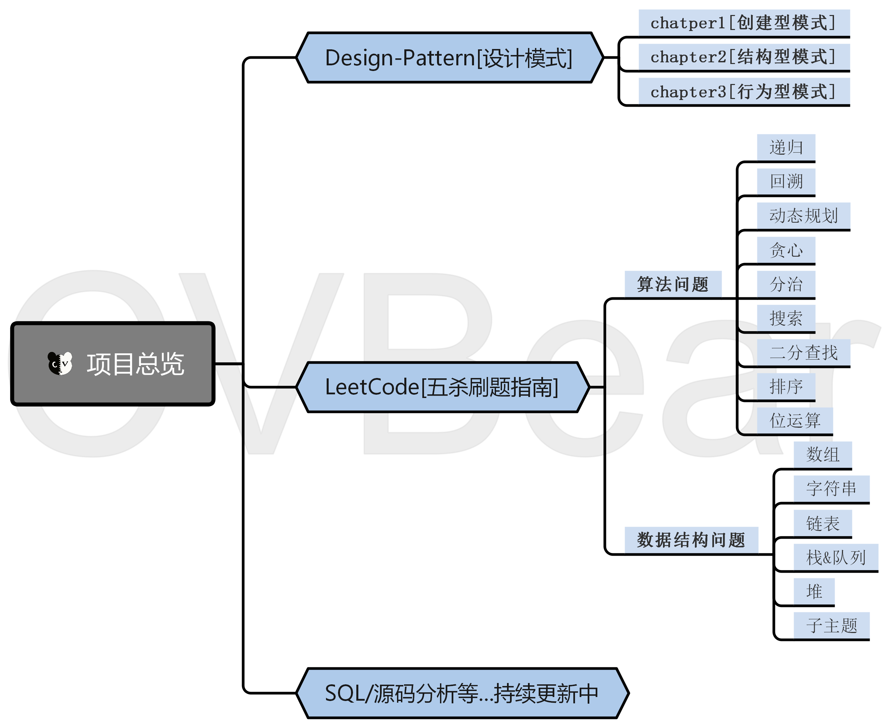

# Easy-Programming[漫话编程]

通俗易懂的教会你必备基础知识！下面是**模块介绍**，**持续更新中.....**！

## Design-Pattern[设计模式]

**目的**：直白的说设计模式是[源码阅读]的前置知识！

| 创建型模式                                              | 结构型模式                                                   | 行为型模式                                                   |
| ------------------------------------------------------- | ------------------------------------------------------------ | ------------------------------------------------------------ |
| 单例 原型 建造者 工厂方法 抽象工厂  | 代理 适配器 桥接 装饰 外观 享元 组合 | 策略 命令 职责链 状态 观察者 中介者 迭代器 访问者 备忘录 模板方法 解释器 |

## LeetCode[五杀刷题指南]

> 致力于通过解决至少同一类算法的5个问题让你掌握算法套路!

**目的**：通过刷题巩固算法和数据结构，下面为你分门别类，一类一类的去刷题目掌握算法思想，以不变应万变!

**子模块说明**

- Algorithms(子模块名)：算法问题汇总并有详细注解，图文会稍后同步！

- Data-Structures(子模块名)：数据结构问题汇总并有详细注解，图文会稍后同步！

**包名说明**

- framework：这是算法框架(模板)
- 算法名作为包名
- 数据结构作为包名

- solution_00xx：代表第几题的题解

### 0.算法思想

> 掌握算法思想才能化繁为简！

| 算法思想                      | 图文(完整版)                                                 |
| ----------------------------- | ------------------------------------------------------------ |
| 蛮力法(Brute-force)           |                                                              |
| 分治(Divide-and-conquer)      |                                                              |
| 减治(Decrease-and-conquer)    | [漫话算法[二分查找]：一首诗解决5道LeetCode题](https://mp.weixin.qq.com/s/dVge_TZyaWvrsFoksEc8lA)！ |
| 变治(Transform-and-conquer)   |                                                              |
| 贪(婪)心(Greedy)              |                                                              |
| 动态规划(Dynamic-programming) |                                                              |

### 1.算法问题(Algorithms)

> 我收集整理了一下几类算法问题一一给你讲解！

| 递归&迭代                                                    | 回溯                                                         | 动态规划                                                     | 贪心                                                         | 分治                                                         | 搜索                                                         | 二分查找                                                     | 排序                                                         | 位运算                                                       |
| ------------------------------------------------------------ | ------------------------------------------------------------ | ------------------------------------------------------------ | ------------------------------------------------------------ | ------------------------------------------------------------ | ------------------------------------------------------------ | ------------------------------------------------------------ | ------------------------------------------------------------ | ------------------------------------------------------------ |
|  |  |  |  |  |  |  |  |  |
| [视频讲解](https://www.bilibili.com/video/BV11A411Y7f5)      | [视频讲解](https://www.bilibili.com/video/BV1qK411T7Nx)      | 视频讲解                                                     | 视频讲解                                                     | 视频讲解                                                     | 视频讲解                                                     | [视频讲解](https://www.bilibili.com/video/BV1Ez4y1Q729)      | 视频讲解                                                     | 视频讲解                                                     |
| 图文讲解                                                     | 图文讲解                                                     | 图文讲解                                                     | 图文讲解                                                     | 图文讲解                                                     | 图文讲解                                                     | [图文讲解](https://mp.weixin.qq.com/s/bjIjX5Mf6WEB0IC-cTAiAA) | 图文讲解                                                     | 图文讲解                                                     |
| 题解汇总                                                     | 题解汇总                                                     | 题解汇总                                                     | 题解汇总                                                     | 题解汇总                                                     | 题解汇总                                                     | 题解汇总                                                     | 题解汇总                                                     | 题解汇总                                                     |

### 2.数据结构问题(Data-Structures)

> 从刷题到掌握数据结构！

| 数组 | 字符串 | 链表 | 栈&队列 | 堆   | 哈希表 | 树   | 图   |
| ---- | ------ | ---- | ------- | ---- | ------ | ---- | ---- |
|      |        |      |         |      |        |      |      |

### 3.题解合集

更新中....

### 4.算法框架(模板)使用说明

#### Algorithms(子模块)

| 模板名   | 获取模板                                            | 能解决的问题                                      | 备注                                                         |
| -------- | --------------------------------------------------- | ------------------------------------------------- | ------------------------------------------------------------ |
| 二分查找 | [二分查找](./Leetcode/doc/template/二分查找模板.md) | 有序数组中的目标元素 查询左边界 查询右边界 |  [二分查找五杀例题解析!](https://mp.weixin.qq.com/s/bjIjX5Mf6WEB0IC-cTAiAA) |
| 递归     | [递归模板](./Leetcode/doc/template/递归模板.md)     | 链表的交换 链表合并 二叉树遍历等...       |                                                              |
| 回溯     | [回溯模板](./Leetcode/doc/template/回溯模板.md)     |                                                   |                                                              |

## SQL[训练指南]

> 通过各种各样的书籍以及面试题中的sql训练强化sql能力!

### Mysql

> mysql相关的sql训练

