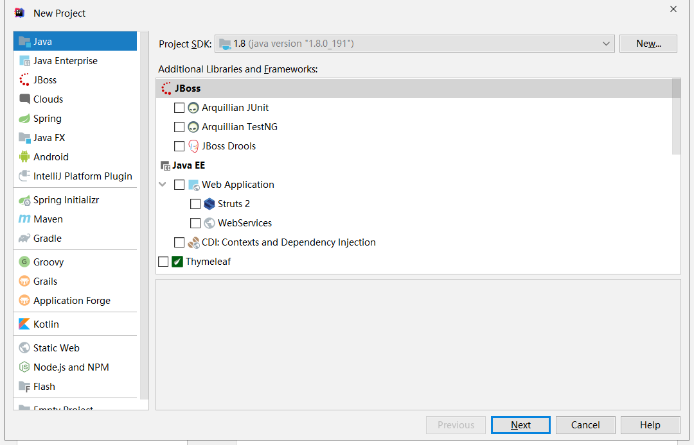
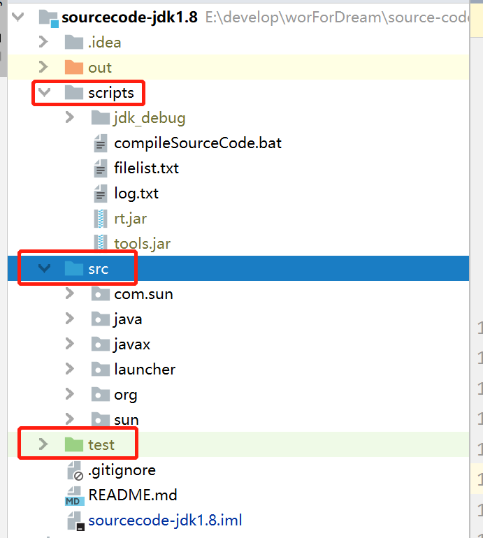
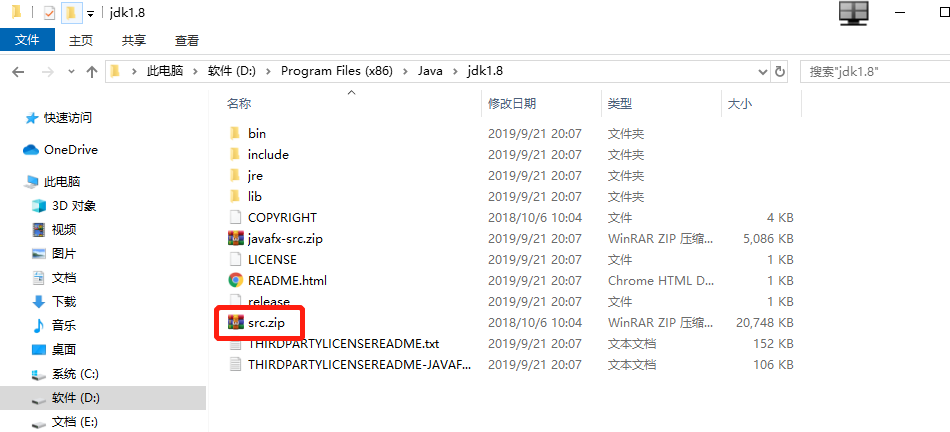
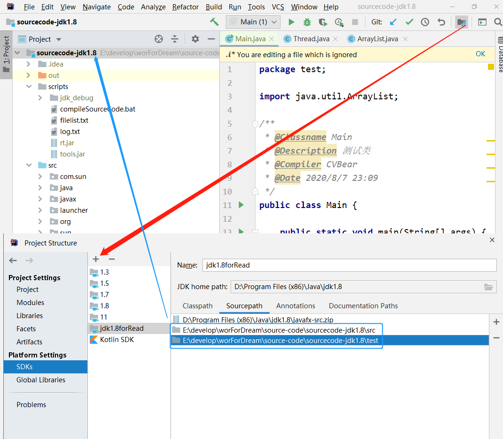
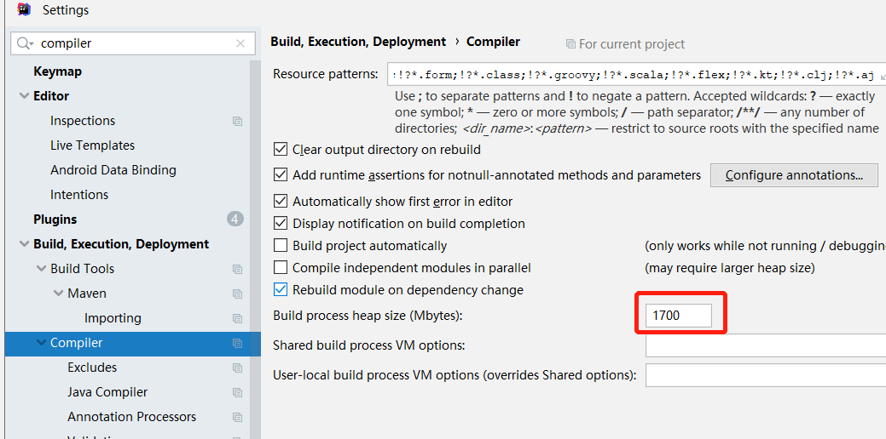
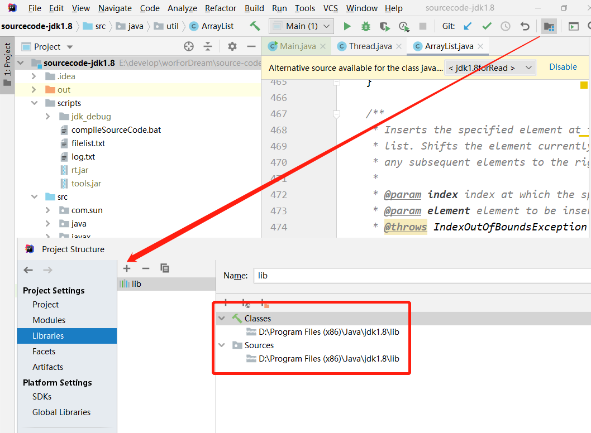
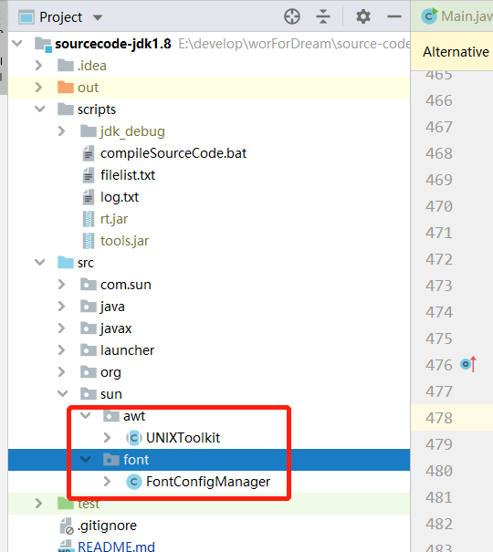
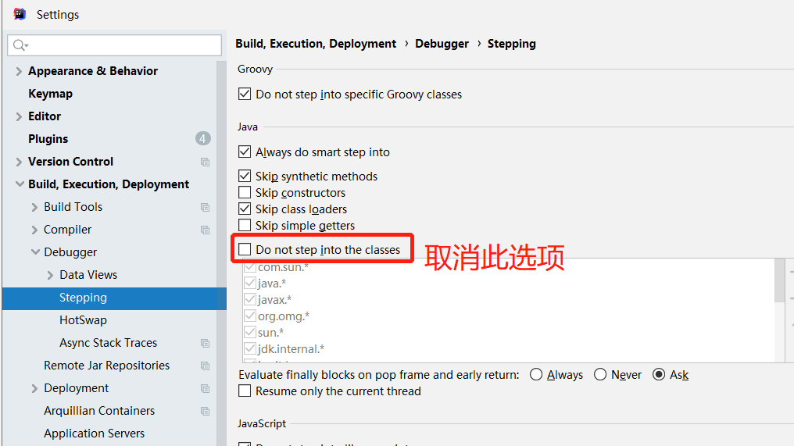

# JDK源码阅读准备篇


无论是刚学Java还是有了一定工作经验，都应该阅读一下源码了，那么今天我们就来看看阅读源码应该准备什么呢？


# 源码阅读环境的搭建

## 1.创建项目

> 这里我起名为`sourcecode-jdk1.8`




## 2.解压源码、创建scripts目录、创建test目录

### ①解压源码

> 将`jdk_home`下的`src.zip`解压到新建工程






### ②创建test测试文件夹

> 用于存储你编写的测试类

1. 创建名为test的普通文件夹
2. 右键Mark Directory as
3. 选中Test Sources Root


### ③创建scripts文件夹

1. 两个jar包为`%JAVA_HOME%\jre\lib\rt.jar;%JAVA_HOME%\lib\tools.jar`：用于编译
2. `compileSourceCode.bat`脚本(见下文源码注释问题)：用于解决新增行注释导致源码debug时报错问题下文有红说明


## 3.替换SDK关联避免影响到原JDK




## 4.解决系统资源不足导致编译失败




## 5.解决缺少依赖问题

> 编译启动报错`com.sun.tools.javac.api`不存在




## 6.解决缺少类的情况

创建sun文件夹及子文件夹font、awt，接着粘贴复制如下两个类即可

`sun.awt`

[UNIXToolkit.java](http://hg.openjdk.java.net/jdk8u/jdk8u/jdk/file/c0dd958bb895/src/solaris/classes/sun/awt/UNIXToolkit.java)

`sun.font`

[FontConfigManager](http://hg.openjdk.java.net/jdk8u/jdk8u/jdk/file/c0dd958bb895/src/solaris/classes/sun/font/FontConfigManager.java)




## 7.解决无法打断点的问题

> 源码调试的时候断点进入不了我们解压的源码文件中可以通过以下方式解决




# 源码注释问题

**问题描述**：添加了新的行注释后再debug会出现源码和断点不匹配的情况

`source code does not match the bytecod`：不重新编译则会出现这个问题

**解决办法**

使用脚本重新编译

**具体步骤**

1. 源码根目录创建scripts文件夹并放入：两个jar包`%JAVA_HOME%\jre\lib\rt.jar;%JAVA_HOME%\lib\tools.jar`

2. `JDK_HOME\jre\lib`目录下创建endorsed目录(我的目录`D:\Program Files (x86)\Java\jdk1.8\jre\lib\endorsed`)

3. 创建`compileSourceCode.bat`脚本：我删除了复制`tools.jar`的部分否则出现了执行失效的问题

   ```powershell
   @echo off
    
   rem 记录当前位置
   set "CURRENT_DIR=%cd%"
    
   rem jdk源码目录
   cd ..
   set "SOURCE_DIR=%cd%\src"
   cd /d %CURRENT_DIR%
    
   rem 编译rt_debug.jar存放的目录
   set "RT_DEBUG_DIR=%CURRENT_DIR%\jdk_debug"
    
   rem rt_debug.jar需要存放的位置
   set "RT_DEBUG_ENDORSED_DIR=%JAVA_HOME%\jre\lib\endorsed"
    
   rem 显示JAVA_HOME变量
   rem echo "%JAVA_HOME%"
    
   rem 如果jdk_debug不存在，则进行创建
   if not exist "%RT_DEBUG_DIR%" mkdir "%RT_DEBUG_DIR%"
    
   rem 生成需要编译的文件列表
   dir /B /S /X "%SOURCE_DIR%\*.java" > "%CURRENT_DIR%\filelist.txt"
    
   rem 执行编译操作 
   javac -encoding UTF-8 -J-Xms16m -J-Xmx1024m -sourcepath %SOURCE_DIR% -cp rt.jar;tools.jar -d %RT_DEBUG_DIR% -g @filelist.txt >> log.txt 2>&1
    
   rem 生成rt_debug.jar
   cd /d "%RT_DEBUG_DIR%"&&jar cf0 rt_debug.jar *
    
   rem 把新生成的jar包放到JDK_HOME\jre\lib\endorsed中（如果没有endorsed文件夹，则手动创建）
   if not exist "%RT_DEBUG_ENDORSED_DIR%" mkdir "%RT_DEBUG_ENDORSED_DIR%"
   copy /y "%RT_DEBUG_DIR%\rt_debug.jar" "%RT_DEBUG_ENDORSED_DIR%\rt_debug.jar"
    
   rem pause&goto:eof
   goto:eof&exit
    
    
   rem 自定义函数：通过全路径获得文件名
   :getFileName
   rem for %%a in ("%~1") do (echo %%~nxa)
   rem for %%a in ("%~1") do (echo %CURRENT_DIR%\%%~nxa)
   for %%a in ("%~1") do (
   set "my_path=%CURRENT_DIR%\%%~nxa"
   )
   goto:eof
    
   rem 参考链接
   rem 如何在bat脚本中定义函数？ https://www.jb51.net/article/53016.htm
   rem 如何从文件全路径中提取文件名？ https://blog.csdn.net/techfield/article/details/83061295
   rem 常用匹配模式 https://www.jb51.net/article/97588.htm
   rem for循环中无法改变变量的值 https://zhidao.baidu.com/question/140583844767053805.html
   rem https://www.cnblogs.com/mq0036/p/3478108.html
   ```

4. 添加完注释以后执行此脚本即可


**使用说明**

点击`compileSourceCode.bat`脚本等待执行结束后即可，执行成功会产生如下文件


`ps`: log日志中出现警告可以忽略不管。


# 参考

[[1]罗小树—csdn博客](https://blog.csdn.net/u010999809/article/details/102762142)：如果无法生效则删除拷贝`tools.jar`的那一部分脚本就可以使用了

[[2]KomorebiShao](http://www.komorebishao.com/2020/idea-java-jdk-funyard/)